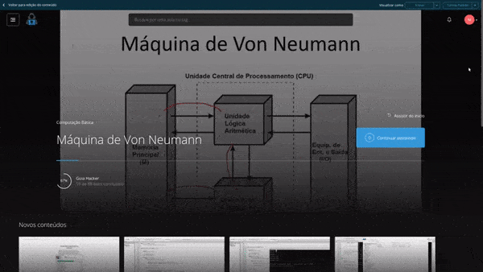

## Codes of the Hacker Guide Course
> A little bit of code written during the [Hacker Guide](https://guiahacker.com) course.

  

  

> 👷 Codified by Matheus Ramalho de Oliveira.  
🔨 Systems Analyst, Full-Stack Developer.  
🏡 Goiânia, Goiás, Brasil.  
✉️ kastorcode@gmail.com  
👍 [instagram.com/kastorcode](https://www.instagram.com/kastorcode)

### 🗓 ️Roadmap
- Basic computing.
- C language.
- Strategic projects.
- Data structure.
- Data manipulation.
- Computer network.
- Analyzing networks.
- Virus development.
- Create and combat viruses.
- Cryptography.
- Analyzing safety failures.
- Breaking passwords.
- Reverse engineering.
